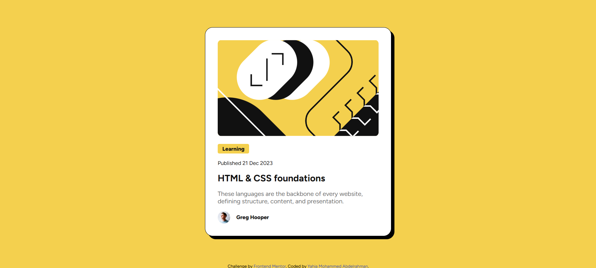
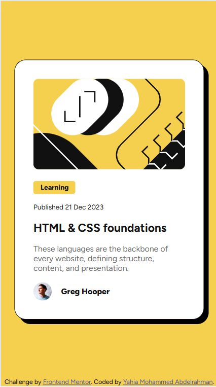

# Frontend Mentor - Blog preview card solution

This is a solution to the [Blog preview card challenge on Frontend Mentor](https://www.frontendmentor.io/challenges/blog-preview-card-ckPaj01IcS). Frontend Mentor challenges help you improve your coding skills by building realistic projects.

## Table of contents

- [Overview](#overview)
  - [The challenge](#the-challenge)
  - [Screenshot](#screenshot)
  - [Links](#links)
- [My process](#my-process)
  - [Built with](#built-with)
  - [What I learned](#what-i-learned)
- [Author](#author)
- [Acknowledgments](#acknowledgments)

## Overview

Made this wonderfull challenge and focused on making it exactly like figma.

### The challenge

Users should be able to:

- See hover and focus states for all interactive elements on the page

### Screenshots





### Links

- Solution URL: [https://github.com/yahia5034/Blog-preview-card](https://github.com/yahia5034/Blog-preview-card)
- Live Site URL: [https://yahia5034.github.io/Blog-preview-card](https://yahia5034.github.io/Blog-preview-card)

## My process

### Built with

- Semantic HTML5 markup
- CSS custom properties
- Flexbox
- Mobile-first workflow (media query)

### What I learned

I practiced HTML semantics and how to make this design using HTML and CSS

```
I am proud of box-shadow i thought it will be hard but it was quite simple
css
.content {
  border: 1px solid;
  border-radius: 20px;
  padding: 2rem;
  width: 27%;
  background-color: hsl(0, 0%, 100%);
  box-shadow: 8px 8px;
}
```

## Author

- Frontend Mentor - [@yahia5034](https://www.frontendmentor.io/profile/yahia5034)

## Acknowledgments

Got help on the text sizes from ChatGPT
